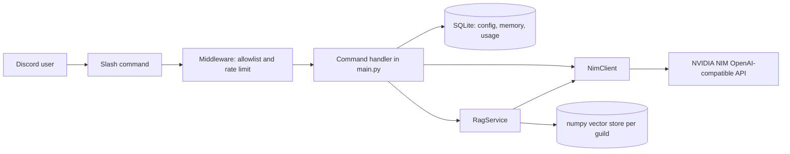
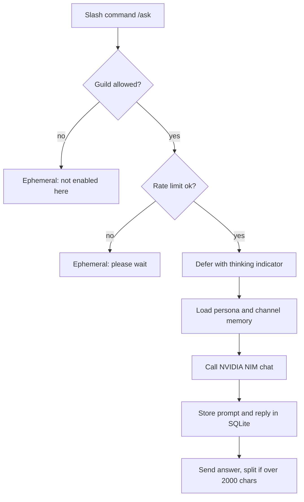
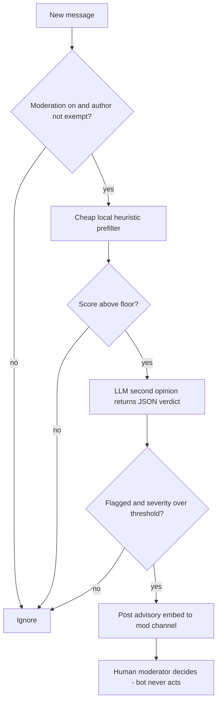

# discord-ai-bot

**A complete Discord AI bot on discord.py** — slash-command chat with per-channel memory, RAG over your server docs, vision on image uploads, and an assist-only moderation mode. Runs on free NVIDIA NIM.


---

## Why

Most "Discord GPT bot" repos are a single 80-line script that pipes messages to an
API and calls it done. This one is shaped like something you would actually keep
running on a server: slash commands with deferral, per-channel memory in SQLite,
retrieval over your own docs, image understanding, rate limiting, a real error
handler, and a moderation mode that is deliberately **advisory only**.

It runs on [NVIDIA NIM](https://build.nvidia.com), which exposes an
OpenAI-compatible endpoint with a free tier — so you can host a genuinely capable
bot for a community without a paid LLM bill. Swap `NIM_BASE_URL` and it also talks
to any other OpenAI-compatible backend.

---

## Features

| Command | What it does |
| ------- | ------------ |
| `/ask` | Chat with the AI. Remembers the last N **messages** per channel (default 12, i.e. 6 question/answer exchanges) so context carries between questions. |
| `/summarize` | Reads the last 5–200 messages and returns a bullet summary with decisions and action items. If the transcript is too long for the model, the **oldest** messages are dropped and the header says so ("last 150 of 200 messages"). |
| `/image` | Attach an image and ask about it. Uses a NIM vision model. |
| `/docs ask` | Answers strictly from your ingested server docs, with numbered citations. |
| `/docs ingest` | Indexes pinned messages and `.txt` / `.md` / `.pdf` attachments from a docs channel. |
| `/docs status` | Shows how many chunks are indexed. |
| `/persona` | Switch the system prompt: assistant, concise, coder, teacher, reviewer, game master. |
| `/model` | View or override the chat model per server. |
| `/forget` | Wipe the bot's memory of the current channel. |
| `/config …` | Set docs/mod channels, toggle moderation, tune thresholds, wipe all data. |
| `/help` | In-Discord command reference. |

Under the hood: async SQLite persistence, per-user cooldown + sliding-window rate
limit, guild allowlist, batched embeddings into a per-guild numpy vector store,
and a unified error handler that apologizes to the user and logs the stack trace.

---

## Architecture

Everything an LLM touches goes through one `NimClient` (chat, vision, embeddings),
so retries and model selection live in a single place.



### Message handling for /ask



### Assist-only moderation



---

## Quickstart

```bash
git clone https://github.com/AleBrito124356/discord-ai-bot.git
cd discord-ai-bot
python -m venv .venv && source .venv/bin/activate   # Windows: .venv\Scripts\activate
pip install -r requirements.txt

cp .env.example .env      # then edit .env
python -m bot.main
```

You need two secrets in `.env`:

- **`DISCORD_BOT_TOKEN`** — create an app in the
  [Discord Developer Portal](https://discord.com/developers/applications),
  enable the **Message Content Intent**, and copy the bot token.
- **`NVIDIA_API_KEY`** — get a free key at
  [build.nvidia.com](https://build.nvidia.com); it starts with `nvapi-`. The
  signup takes about two minutes.

Set `ALLOWED_GUILD_IDS` to your server's ID for **instant** slash-command sync
(global sync can take up to an hour the first time). Full walkthrough — including
the OAuth2 invite URL, permission integer, systemd unit and Docker — is in
[`docs/setup.md`](docs/setup.md).

---

## Usage

```text
/ask prompt: explain async/await in Python like I have 5 minutes
```
> **Bot** *(thinking…)*
> async/await lets one thread juggle many waiting tasks…
> • `async def` marks a coroutine
> • `await` yields control while something slow finishes
> • an event loop runs the ready ones
> Ask a follow-up and it remembers this thread of the conversation.

```text
/summarize count: 100
```
> **Summary of the last 87 messages**
> • Decided to ship v2 on Friday; Ana owns the changelog
> • Open question: do we migrate the DB before or after the freeze?
> • Action: Luis to benchmark the new embedding model

```text
/image  image: <screenshot.png>  question: what error is shown here?
```
> The traceback is a `KeyError: 'user_id'` raised in `handlers.py` line 42…

```text
/docs ask question: what is our refund window?
```
> Refunds are accepted within 30 days of purchase. [1]
> **Sources**
> [1] pinned: billing-policy.md

Admin setup (needs **Manage Server**):

```text
/config docs-channel channel: #docs
/docs ingest
/config mod-channel channel: #mod-log
/config moderation enabled: true
```

---

## Moderation philosophy: assist, do not enforce

This bot **never bans, kicks, mutes, deletes, or edits anything.** The invite URL
requests no moderation permissions at all.

When moderation is enabled, every message runs through a cheap local heuristic
(caps ratio, mass mentions, link spam, a few keyword signals). Only messages that
clear that floor cost an API call, where an LLM gives a structured second opinion.
If it agrees and the severity clears your threshold, the bot posts a short,
sourced advisory to a mod-only channel — with a jump link and a rationale. A human
reads it and decides.

Why this stance: automated enforcement on ambiguous language produces false
positives that damage trust in a community faster than the occasional missed rule
violation. Keeping a human in the loop is the safer default. You can tune
sensitivity with `/config threshold` and exempt trusted users or roles with
`/config mod-allow`.

---

## Privacy: what is stored and how to wipe it

Everything lives in a local SQLite database (`data/bot.db`) and per-guild numpy
files under `data/rag/`. Nothing is sent anywhere except to the NIM endpoint you
configured.

| Data | Where | How to remove |
| ---- | ----- | ------------- |
| Recent `/ask` turns per channel | `channel_history` table | `/forget` in that channel |
| Ingested doc chunks + embeddings | `data/rag/<guild>.npy` and `.json` | re-run `/docs ingest` or `/config wipe` |
| Per-guild config | `guild_config` table | `/config wipe` |
| Usage counters | `usage` table | `/config wipe` |
| Moderation exempt list | `mod_allowlist` table | `/config wipe` |

`/config wipe confirm: true` erases **all** of the above for a server in one shot,
including `/ask` memory kept in threads, forum posts and channels that have
since been deleted (memory rows carry their server id since schema v2).
Deleting the `data/` directory resets the bot completely.

---

## Project structure

```text
discord-ai-bot/
├── bot/
│   ├── __init__.py
│   ├── __main__.py        # python -m bot
│   ├── config.py          # env-driven settings
│   ├── personas.py        # named system prompts
│   ├── nim_client.py      # NVIDIA NIM chat / vision / embeddings
│   ├── persistence.py     # async SQLite: config, memory, usage, allowlist
│   ├── middleware.py      # cooldown, rate limit, guild guard, error handler
│   ├── rag.py             # ingest + numpy vector store + cited answers
│   ├── moderation.py      # assist-only heuristic + LLM flagging
│   └── main.py            # bot + all slash commands
├── docs/
│   └── setup.md           # portal, intents, invite URL, systemd, Docker
├── tests/
│   └── test_core.py       # offline unit tests for the pure logic
├── .env.example
├── .gitignore
├── Dockerfile
├── requirements.txt
├── requirements-dev.txt
├── LICENSE
└── README.md
```

Run the offline tests (no token or API key needed):

```bash
pip install -r requirements-dev.txt
pytest
```

---

## Configuration reference

| Variable | Default | Purpose |
| -------- | ------- | ------- |
| `DISCORD_BOT_TOKEN` | — | Bot token from the Developer Portal. |
| `NVIDIA_API_KEY` | — | Free NIM key, starts with `nvapi-`. |
| `ALLOWED_GUILD_IDS` | empty | Comma-separated server IDs. Empty = allow all + global sync. |
| `NIM_MODEL` | `meta/llama-3.3-70b-instruct` | Default chat model. |
| `NIM_VISION_MODEL` | `meta/llama-3.2-90b-vision-instruct` | Vision model for `/image`. |
| `NIM_EMBED_MODEL` | `nvidia/nv-embedqa-e5-v5` | Embedding model for RAG. |
| `NIM_BASE_URL` | `https://integrate.api.nvidia.com/v1` | Any OpenAI-compatible endpoint. |
| `DATA_DIR` | `./data` | Where SQLite and vector stores live. |
| `COOLDOWN_SECONDS` | `5` | Minimum gap between a user's commands. |
| `RATE_LIMIT_PER_MINUTE` | `12` | Max commands per user per minute. |
| `NIM_MAX_TOKENS` | `900` | Max tokens per response. |

---

## Related projects

- **[telegram-ai-agents](https://github.com/AleBrito124356/telegram-ai-agents)** — the same idea for Telegram: assistant, PDF-RAG and vision bots.
- **[whatsapp-ai-agent](https://github.com/AleBrito124356/whatsapp-ai-agent)** — a WhatsApp agent on the Meta Cloud API with FAQ answering and appointment booking.
- **[rag-blueprints](https://github.com/AleBrito124356/rag-blueprints)** — eight RAG architectures if you want to go deeper than the numpy store used here.
- **[nim-agent-lab](https://github.com/AleBrito124356/nim-agent-lab)** — twelve agent patterns in pure Python on the same free NVIDIA NIM endpoint.

---

## License

MIT © 2026 Alejandro Brito. See [LICENSE](LICENSE).
