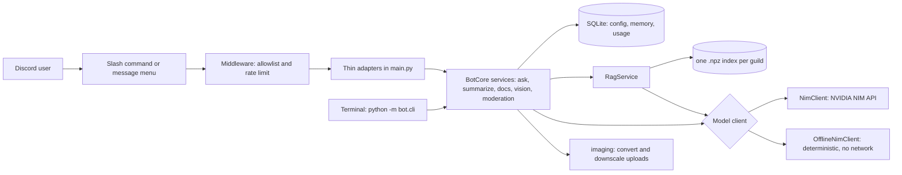
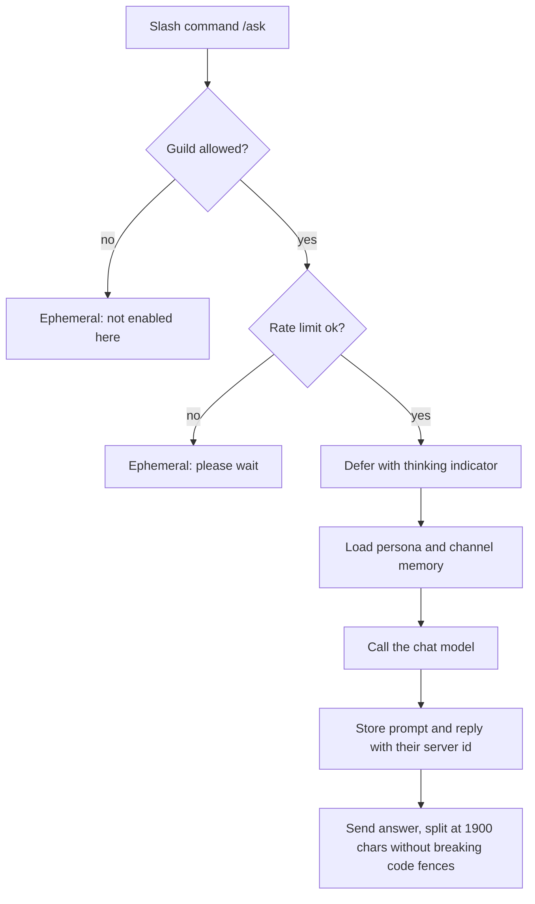
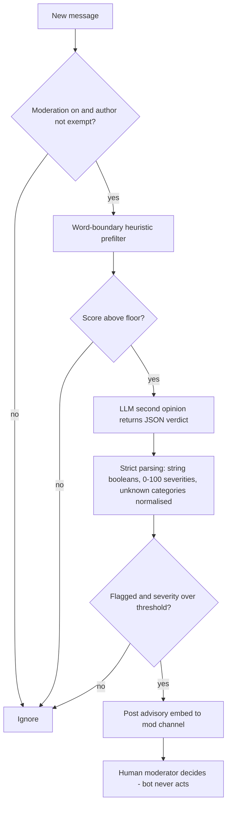

# discord-ai-bot

**A complete Discord AI bot on discord.py** — slash-command chat with per-channel memory, cited RAG over your server docs, vision on image uploads, right-click message menus, and an assist-only moderation mode. Runs on free NVIDIA NIM — or fully offline, with no keys at all.


---

## Why

Most "Discord GPT bot" repos are a single 80-line script that pipes messages to an
API and calls it done. This one is shaped like something you would actually keep
running on a server: slash commands with deferral, per-channel memory in SQLite
(with in-place schema migrations), retrieval over your own docs that only cites
what it used, image understanding that fits the model's real limits, rate
limiting, a real error handler, and a moderation mode that is deliberately
**advisory only**.

It runs on [NVIDIA NIM](https://build.nvidia.com), which exposes an
OpenAI-compatible endpoint with a free tier — so you can host a genuinely capable
bot for a community without a paid LLM bill. Swap `NIM_BASE_URL` and it also talks
to any other OpenAI-compatible backend. Set `BOT_OFFLINE=1` and it runs on a
deterministic local backend instead, which is how the test suite and the terminal
simulator work.

---

## Features

| Command | What it does |
| ------- | ------------ |
| `/ask` | Chat with the AI. Remembers the last N **messages** per channel (default 12, i.e. 6 question/answer exchanges), threads included. |
| `/summarize` | Reads the last 5–200 messages and returns a bullet summary with decisions and action items. If the transcript is longer than the model budget, the **oldest** messages are dropped and the header says so (`Summary of the last 150 of 200 messages`). |
| `/image` | Attach an image (PNG, JPG, WEBP, GIF, BMP… up to 25 MB) and ask about it. It is converted, EXIF-rotated and downscaled to what the NIM vision model accepts first; the reply notes when that happened. |
| `/docs ask` | Answers from your ingested server docs. Only the excerpts the answer actually cites (`[n]`) are listed as sources; chunks under the relevance floor are never sent to the model. |
| `/docs ingest` | Indexes **all** pinned messages (not just the first 50) and `.txt` / `.md` / `.pdf` attachments from the docs channel. |
| `/docs status` | Chunks, sources and the embedding model the index was built with. |
| **Ask AI about this** | Right-click a message → Apps. Explains or answers it privately; if it has an image, describes the image. |
| **Summarize from here** | Right-click a message → Apps. Summarizes the conversation from that message onward, linking back to it. |
| `/stats` | Usage per command, top users, stored memory and indexed chunks (Manage Server). |
| `/persona` | Switch the system prompt: assistant, concise, coder, teacher, reviewer, game master. |
| `/model` | View or override the chat model per server. |
| `/forget` | Wipe the bot's memory of the current channel or thread. |
| `/config …` | Set docs/mod channels, toggle moderation, tune thresholds and memory, wipe all data. |
| `/help` | In-Discord command reference. |

Long answers are split at 1900 characters without breaking code fences: every
part re-opens the fence with its language tag, so `coder` persona answers render
correctly.

---

## Try it with no keys

Everything except the Discord gateway runs from a terminal through the same
services, SQLite schema and RAG store the bot uses. By default it uses the
**offline backend**: hashed bag-of-words embeddings and extractive answers, so
retrieval, citations, summaries and moderation really run, deterministically.
It never invents text, and it says `[offline mode]` whenever it answers.

```bash
pip install -r requirements.txt          # or: pip install -e ".[dev]"
python -m bot.cli docs ingest docs/
python -m bot.cli docs ask "what permission integer does the invite URL use?"
```

The outputs below are copied from a real run (`photo.webp` is a 4000x3000
solid-blue test image):

```text
$ python -m bot.cli docs ingest docs/
Indexed 6 chunks from 1 document(s) in docs.
embedding model: offline/hashed-bow-512 (512-d)

$ python -m bot.cli docs ask "what permission integer does the invite URL use?"
[offline mode] Best-matching passage(s) from your docs: Permission integer 84992 [1] Build an OAuth2 invite URL with both scopes the bot needs: [1]

Sources
[1] setup.md

$ python -m bot.cli moderate "free nitro, click this link discord.gg/x"
prefilter score: 0.80 (floor 0.30)  reasons: possible scam or phishing bait, contains a Discord invite link
model verdict: {"flag": true, "category": "scam", "severity": 0.85, "rationale": "Looks like scam or phishing bait (offline rules)."}
advisory posted to the mod channel: YES (threshold 0.60; the bot never acts on its own)

$ python -m bot.cli moderate "what a paradox"
prefilter score: 0.00 (floor 0.30)  reasons: none
model call: skipped (below the prefilter floor, no API cost)
advisory posted to the mod channel: no (threshold 0.60; the bot never acts on its own)

$ python -m bot.cli summarize examples/standup.txt
Summary of the last 12 messages
[offline mode] Extractive summary (5 of 12 lines):
• Question: Ana: nice. so do we switch the docs index to it?
• Decision: Ana: ok, we decided to ship v2 on Friday with the new embedding model
• Question: Marta: open question: do we migrate the database before or after the freeze?
• Action: Marta: Ana owns the changelog, I will update the setup guide by Thursday
• Action: Luis: I'll write the migration test tomorrow

$ python -m bot.cli image photo.webp --question "what is this?"
input: 4000x3000 WEBP, 20 KB
sent to vision model: 1568x1176 image/jpeg, 10 KB, 14888 base64 chars (budget 180000)
[offline mode] I can not see image content without a vision model, but I measured it: a 1568x1176 landscape JPEG (image/jpeg), brightness 42%, dominant colours: blue 100%. Your question was: "what is this?"
(Image converted WEBP to JPEG, resized 4000x3000 -> 1568x1176, 20 KB -> 10 KB to fit the vision model's limits.)

$ python -m bot.cli stats
7 command(s) recorded · 0 stored /ask message(s)

per command:
/moderate — 2
/docs ask — 1
/docs ingest — 1
/image — 1
/stats — 1
/summarize — 1

top users:
1. user 1 — 7
```

Other subcommands: `ask "…"` (per-channel memory, `--channel`/`--user` to
simulate several), `summarize FILE --from-line N` (like *Summarize from here*),
`docs ask … --explain` (prints every retrieved excerpt with its cosine score),
`docs status` and `forget`. The simulator keeps its data in `<DATA_DIR>/sim`
(override with `--data-dir`). Add `--live` to run the same commands against
NVIDIA NIM with your `NVIDIA_API_KEY`. After `pip install -e .` the program is
also available as `discord-ai-bot-sim`.

What the offline backend can **not** do: write free-form answers (`/ask` gets a
labelled placeholder that shows the persona and memory it would have sent) or
see what is in an image (it measures size, format, brightness and colours). Its
retrieval is lexical, not semantic.

You can also run the real Discord bot on it — `BOT_OFFLINE=1` plus a
`DISCORD_BOT_TOKEN` — to check your server setup before getting an NVIDIA key.

---

## Architecture

Discord handlers are thin adapters. All behaviour lives in Discord-free services
(`bot/services.py`) that take plain ids and strings, which is what the terminal
simulator and the tests drive. Everything an LLM touches goes through one client
interface, implemented by `NimClient` (NVIDIA NIM) and `OfflineNimClient`.



### Message handling for /ask



### Assist-only moderation



---

## Quickstart

```bash
git clone https://github.com/AleBrito124356/discord-ai-bot.git
cd discord-ai-bot
python -m venv .venv && source .venv/bin/activate   # Windows: .venv\Scripts\activate
pip install -r requirements.txt

cp .env.example .env      # then edit .env
python -m bot.main
```

You need two secrets in `.env`:

- **`DISCORD_BOT_TOKEN`** — create an app in the
  [Discord Developer Portal](https://discord.com/developers/applications),
  enable the **Message Content Intent**, and copy the bot token.
- **`NVIDIA_API_KEY`** — get a free key at
  [build.nvidia.com](https://build.nvidia.com); it starts with `nvapi-`. The
  signup takes about two minutes. (Or set `BOT_OFFLINE=1` to start without it.)

The `.env` is read from the repository root only — never from a parent
directory — and real environment variables always win over it.

Set `ALLOWED_GUILD_IDS` to your server's ID for **instant** slash-command sync
(global sync can take up to an hour the first time). Full walkthrough — including
the OAuth2 invite URL, permission integer, systemd unit and Docker — is in
[`docs/setup.md`](docs/setup.md).

---

## Usage

```text
/ask prompt: explain async/await in Python like I have 5 minutes
```
> **Bot** *(thinking…)*
> async/await lets one thread juggle many waiting tasks…
> • `async def` marks a coroutine
> • `await` yields control while something slow finishes
> • an event loop runs the ready ones

```text
/summarize count: 100
```
> **Summary of the last 87 messages**
> • Decided to ship v2 on Friday; Ana owns the changelog
> • Open question: do we migrate the DB before or after the freeze?
> • Action: Luis to benchmark the new embedding model

(87, not 100: bot messages and empty messages are skipped.)

```text
/image  image: <screenshot.webp>  question: what error is shown here?
```
> The traceback is a `KeyError: 'user_id'` raised in `handlers.py` line 42…
> -# Image converted WEBP to JPEG, resized 3024x1964 -> 1568x1018, 812 KB -> 131 KB to fit the vision model's limits.

```text
/docs ask question: what is our refund window?
```
> Refunds are accepted within 30 days of purchase. [1]
> **Sources**
> [1] pinned: billing-policy.md

If the answer cites nothing (for example "I could not find that in the server's
documents"), there is no Sources footer, and if no chunk clears `RAG_MIN_SCORE`
the model is not called at all.

Admin setup (needs **Manage Server**):

```text
/config docs-channel channel: #docs
/docs ingest
/config mod-channel channel: #mod-log
/config moderation enabled: true
/stats
```

---

## Moderation philosophy: assist, do not enforce

This bot **never bans, kicks, mutes, deletes, or edits anything.** The invite URL
requests no moderation permissions at all.

When moderation is enabled, every message runs through a cheap local heuristic
(caps ratio, mass mentions, link spam, a few keyword patterns matched on **word
boundaries**, so "paradox", "slurped" or "fire retardant" never trigger). Only
messages that clear that floor cost an API call, where an LLM gives a structured
second opinion. Its JSON is parsed strictly: `"flag": "false"` means false, a
severity of `85` or `"85%"` means 0.85, and an unusable reply is dropped rather
than trusted. If the model agrees and the severity clears your threshold, the bot
posts a short, sourced advisory to a mod-only channel — with a jump link and a
rationale. A human reads it and decides.

Why this stance: automated enforcement on ambiguous language produces false
positives that damage trust in a community faster than the occasional missed rule
violation. Keeping a human in the loop is the safer default. You can tune
sensitivity with `/config threshold`, exempt trusted users or roles with
`/config mod-allow`, and try any message with `python -m bot.cli moderate "…"`.

---

## Privacy: what is stored and how to wipe it

Everything lives in a local SQLite database (`data/bot.db`) and one index file per
server under `data/rag/`. Nothing is sent anywhere except to the NIM endpoint you
configured (and nothing at all in offline mode).

| Data | Where | How to remove |
| ---- | ----- | ------------- |
| Recent `/ask` messages per channel or thread | `channel_history` table (with server id) | `/forget` in that channel |
| Ingested doc chunks + embeddings | `data/rag/<guild>.npz` | re-run `/docs ingest` or `/config wipe` |
| Per-guild config | `guild_config` table | `/config wipe` |
| Usage counters | `usage` table | `/config wipe` |
| Moderation exempt list | `mod_allowlist` table | `/config wipe` |

`/config wipe confirm: true` erases **all** of the above for a server in one shot,
including `/ask` memory kept in threads, forum posts and channels that have
since been deleted: memory rows carry their server id since schema v2. Rows
written by version 1.0 are migrated in place; they get their server id the next
time their channel is used, and until then the wipe matches them by the ids of
every channel and active thread it can still see.
Deleting the `data/` directory resets the bot completely.

The docs index is written atomically (temp file + rename) together with the
embedding model, dimension and row count it was built with. An index that does
not match what is on disk, or that was built with a different `NIM_EMBED_MODEL`,
is refused with a "re-run `/docs ingest`" message instead of silently citing the
wrong text.

---

## Project structure

```text
discord-ai-bot/
├── bot/
│   ├── __init__.py
│   ├── __main__.py        # python -m bot
│   ├── config.py          # env-driven settings, explicit .env loading
│   ├── personas.py        # named system prompts
│   ├── prompts.py         # task prompts shared by services and offline backend
│   ├── nim_client.py      # NVIDIA NIM chat / vision / embeddings, retries
│   ├── offline.py         # deterministic offline backend (same interface)
│   ├── imaging.py         # convert / downscale uploads for the vision model
│   ├── persistence.py     # async SQLite: config, memory, usage, allowlist, migrations
│   ├── middleware.py      # cooldown, rate limit, guild guard, error handler
│   ├── rag.py             # chunking, atomic .npz store, relevance floor, citations
│   ├── moderation.py      # assist-only heuristic + strict LLM verdicts
│   ├── textutil.py        # fence-aware splitting, summarize transcripts
│   ├── services.py        # Discord-free business logic (BotCore)
│   ├── main.py            # bot, slash commands, message menus (thin adapters)
│   └── cli.py             # terminal simulator
├── docs/setup.md          # portal, intents, invite URL, systemd, Docker
├── examples/standup.txt   # sample transcript for the simulator
├── tests/                 # 157 offline tests (fakes for Discord and NIM)
├── .env.example
├── Dockerfile
├── pyproject.toml         # package, console scripts, pytest config
├── requirements.txt
├── requirements-dev.txt
├── CHANGELOG.md
├── LICENSE
└── README.md
```

## Tests

```bash
pip install -r requirements-dev.txt      # or: pip install -e ".[dev]"
pytest
```

157 tests, fully offline (no token, no key, no network), in well under 30 seconds (about 13-20 s here).
They cover persistence and the v1 → v2 migration, the RAG store's integrity
checks, the NIM client against a mock HTTP transport (retries, error mapping,
payloads), moderation parsing, image normalisation, the offline backend, the CLI,
and every slash command, message menu and the moderation listener driven with
fake Discord objects. Every bug fixed in 1.1 has a regression test that fails if
the old code comes back.

---

## Configuration reference

| Variable | Default | Purpose |
| -------- | ------- | ------- |
| `DISCORD_BOT_TOKEN` | — | Bot token from the Developer Portal. |
| `NVIDIA_API_KEY` | — | Free NIM key, starts with `nvapi-`. Not needed offline. |
| `BOT_OFFLINE` | empty | `1` = use the deterministic offline backend instead of NIM (same as `NIM_BASE_URL=offline`). |
| `ALLOWED_GUILD_IDS` | empty | Comma-separated server IDs. Empty = allow all + global sync. |
| `NIM_MODEL` | `meta/llama-3.3-70b-instruct` | Default chat model. |
| `NIM_VISION_MODEL` | `meta/llama-3.2-90b-vision-instruct` | Vision model for `/image` and *Ask AI about this*. |
| `NIM_EMBED_MODEL` | `nvidia/nv-embedqa-e5-v5` | Embedding model for RAG. Changing it requires `/docs ingest` again (the bot tells you). |
| `NIM_BASE_URL` | `https://integrate.api.nvidia.com/v1` | Any OpenAI-compatible endpoint, or `offline`. |
| `RAG_MIN_SCORE` | backend default | Minimum cosine similarity for a chunk to be used. Defaults: 0.2 with NIM (not calibrated for every embedder; raise it if unrelated chunks are cited, lower it if nothing is found), 0.05 offline. |
| `NIM_IMAGE_MAX_SIDE` | `1568` | Longest image side sent to the vision model. |
| `NIM_IMAGE_MAX_B64` | `180000` | Base64 budget per image; NVIDIA's hosted examples use this inline limit. Raise it for self-hosted NIM. |
| `DATA_DIR` | `./data` | Where SQLite and the docs indexes live. |
| `COOLDOWN_SECONDS` | `5` | Minimum gap between a user's commands. |
| `RATE_LIMIT_PER_MINUTE` | `12` | Max commands per user per minute. |
| `NIM_MAX_TOKENS` | `900` | Max tokens per response. |
| `BOT_ENV_FILE` | `<repo>/.env` | Alternative `.env` path to load. |

---

## Related projects

- **[telegram-ai-agents](https://github.com/AleBrito124356/telegram-ai-agents)** — the same idea for Telegram: assistant, PDF-RAG and vision bots.
- **[whatsapp-ai-agent](https://github.com/AleBrito124356/whatsapp-ai-agent)** — a WhatsApp agent on the Meta Cloud API with FAQ answering and appointment booking.
- **[rag-blueprints](https://github.com/AleBrito124356/rag-blueprints)** — eight RAG architectures if you want to go deeper than the numpy store used here.
- **[nim-agent-lab](https://github.com/AleBrito124356/nim-agent-lab)** — twelve agent patterns in pure Python on the same free NVIDIA NIM endpoint.

---

## License

MIT © 2026 Alejandro Brito. See [LICENSE](LICENSE).
